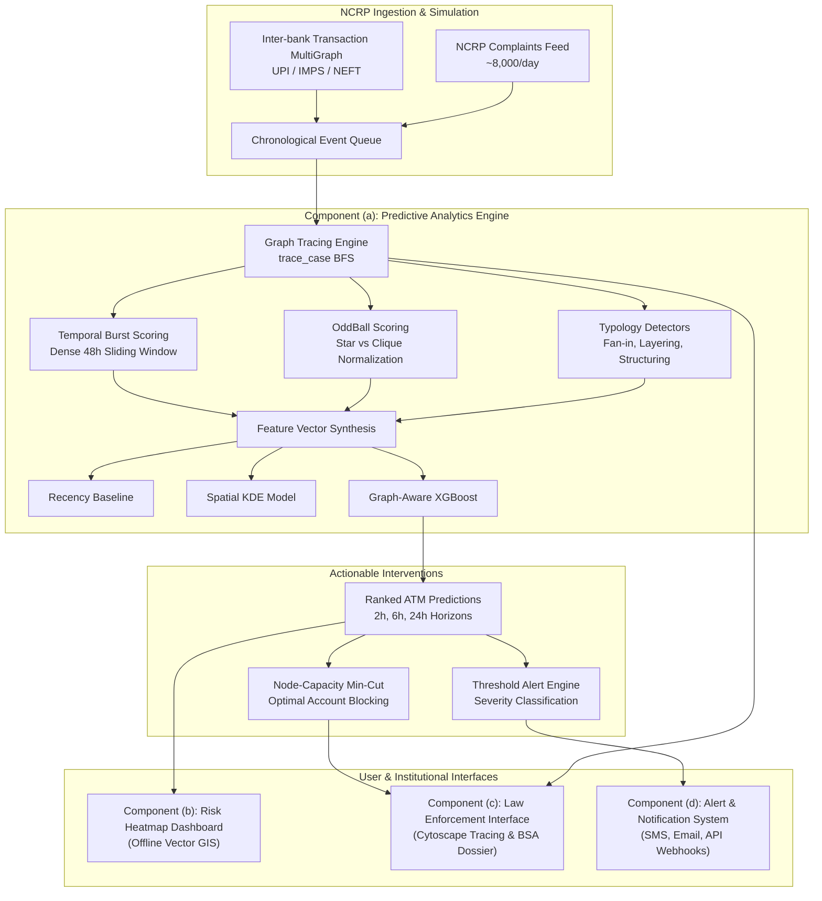

# ORION: Graph-Aware Prediction of Cyber-Fraud Cash-Out Hotspots and Fund-Freezing Recommendations
### Smart India Hackathon 2026 · Problem Statement ID: 26184
#### Organization: Ministry of Home Affairs (MHA) | Indian Cybercrime Coordination Centre (I4C)

> **Development of a Predictive Analytics Framework for Cybercrime Complaints to Forecast Likely Cash Withdrawal Locations in Advance, Enabling Generation of Actionable Intelligence for Timely and Proactive Cybercrime Intervention.**

---

## 1. Operational Context & Mission

The **National Cybercrime Reporting Portal (NCRP)** serves as the centralized nodal portal across India, currently processing **upwards of 8,000 complaints on a daily basis**. A predominant volume of these complaints involve organized financial cyber fraud (vishing, task fraud, investment scams). 

### The Reactive Bottleneck
Under current operations, cybercrime intervention is largely **reactive**:
1. Victims report financial losses hours after the incident.
2. Syndicates rapidly route funds through multiple tiers of simulated or compromised "mule bank accounts" (Layer-1 and Layer-2 mules).
3. The stolen money is withdrawn in cash at Automated Teller Machines (ATMs) or micro-ATMs before inter-bank freezing requests under the **Citizen Financial Cyber Fraud Reporting and Management System (CFCFRMS)** can propagate.
4. Once converted to cash, money trails go dark and recovery rates drop drastically.

### The MuleTrail Proactive Paradigm
**MuleTrail** inverts this dynamic from reactive investigation to **proactive prevention**. By synthesizing graph analytics, behavioral typologies, structural anomaly scoring, and geospatial machine learning, MuleTrail **forecasts likely ATM cash-out locations and time windows in advance**. This generates timely, cross-jurisdictional intelligence enabling:
- **Law Enforcement Agencies (LEAs)** to dispatch PCR patrols and deploy tactical teams at predicted ATM hotspots.
- **Banks & Financial Institutions (FIs)** to place targeted cash-hold alerts and preemptively freeze critical mule accounts using a novel **node-capacity minimum-cut algorithm**.

---

## 2. Key Deliverables Mapping

| # | Official Deliverable | System Component | Implementation & Features |
|---|---|---|---|
| **a** | **Predictive Analytics Engine** | `backend/app/predict/`<br>`backend/app/detect/`<br>`backend/app/graph/` | • Multi-hop transaction graph tracing (`trace_case`).<br>• 5 Typology detectors (Mule Fan-in, Layering, Structuring, Scatter, Rapid Pass-through).<br>• OddBall structural anomaly scoring (Star vs Clique power-law analysis).<br>• Sliding-window temporal burst scoring.<br>• Trio of cash-out models: Recency Baseline, Equirectangular Spatial KDE, and Graph-Aware XGBoost with tree SHAP explainability. |
| **b** | **Risk Heatmap Dashboard** | `frontend/src/screens/RiskHeatmap.tsx`<br>`frontend/src/components/` | • GIS-enabled vector map rendering district boundaries without external tile servers (offline-first).<br>• ATM risk visualization with proportional color-coded confidence rings.<br>• Drill-down filters by forecast horizon (2h, 6h, 24h), probability threshold slider, and model selector.<br>• Inspector drawer showing top-3 explainability reasons linked to source records. |
| **c** | **Law Enforcement Interface** | `frontend/src/screens/CaseView.tsx`<br>`frontend/src/screens/CommandCenter.tsx` | • Interactive left-to-right Cytoscape graph visualizer.<br>• Step-by-step chronological fund playback animation.<br>• Inferred role tagging (Layer-1, Collector, Layer-2) strictly separated from ground truth.<br>• Case dossier and Section 63 Bharatiya Sakshya Adhiniyam, 2023 (BSA) evidence compliance. |
| **d** | **Alert & Notification System** | `frontend/src/screens/Alerts.tsx`<br>`backend/app/alerts/` | • Threshold-triggered real-time dispatch engine.<br>• Multi-channel mock delivery logging (SMS to patrols, Email briefs to DCCPS, REST Webhooks to Police CAD / Bank CFCFRMS).<br>• Interactive TopBar notification bell with unread counters and acknowledgement workflows. |

---

## 3. End-to-End System Architecture



---

## 4. Algorithmic Innovations

### 4.1 Node-Capacity Minimum-Cut Fund Blocking
Traditional min-cut algorithms cut *edges*, but bank freezing interventions operate on *nodes (accounts)*. MuleTrail applies **directed node splitting** ($v \to v_{\text{in}} \to v_{\text{out}}$) with unit-normalized edge capacities:
$$c(v_{\text{in}}, v_{\text{out}}) = 1 - 0.01 \times \left(\frac{\text{Money through } v}{\text{Total case amount}}\right)$$
- **Guaranteed Account Minimization:** Cutting $k$ accounts is strictly cheaper than cutting $k+1$ accounts.
- **Volume Tiebreaking:** Among equal-sized cuts, accounts carrying higher fraud volume are preferred.
- **Chronological Guard:** Accounts whose funds have already departed are assigned infinite capacity ($c = \infty$), preventing wasted freeze orders.

### 4.2 Tri-Model Spatial & Temporal Prediction
1. **Recency Baseline:** Exponential time-decay model scoring ATMs based on historical chain withdrawals.
2. **Equirectangular Spatial KDE:** Continuous Gaussian density estimation over Cartesian kilometer offsets.
3. **Graph-Aware XGBoost:** Binary classifier trained on distance to Layer-2 mule districts, lookback withdrawal counts (7d, 30d), KDE density, graph hops to active funds, burst metrics, and district-hop indicators. Top-3 reasons derived via tree SHAP feature contributions (`pred_contribs=True`).

### 4.3 Behavioral Typology Detectors
- **Mule Fan-In:** Accounts receiving from $\ge 3$ distinct senders in 6h and forwarding $\ge 90\%$ in 24h ($\ge 2$ historical episodes), guarded by a 24h receipt-coverage window against merchant false positives.
- **Layering Chain:** Paths of $\ge 4$ accounts with intermediary hop delays $< 3$h and $85\%\text{--}98\%$ flow coverage.
- **Structuring:** Transfers structured in the $[\text{₹}9,000, \text{₹}9,900]$ bracket to evade regulatory thresholds.
- **Scatter:** Fan-out to $\ge 6$ receivers within 2 hours.
- **Rapid Pass-Through:** Inflow forwarding $\ge 90\%$ within 60 minutes ($\ge 3$ episodes).

---

## 5. Repository Structure

```text
SIH26/
├── run.sh                          # One-command startup script (macOS/Linux/Git Bash)
├── run.ps1                         # One-command startup script (Windows PowerShell)
├── requirements.txt                # Unified Python dependencies
├── CLAUDE.md                       # Comprehensive technical brief and build spec
├── OFFICIAL_PROJECT_REPORT.md      # Submission-grade technical evaluation report
│
├── backend/
│   ├── requirements.txt            # Backend dependencies (FastAPI, NetworkX, XGBoost, etc.)
│   ├── pytest.ini
│   ├── .cache/                     # Precomputed simulation and model cache (gitignored)
│   ├── scenarios/
│   │   └── indore_demo.json        # Seeded multi-district evaluation scenario
│   ├── tests/                      # 68 comprehensive unit and integration tests
│   │   ├── test_alerts.py          # Alert triggers, channels, and acknowledgements
│   │   ├── test_blocking.py        # Min-cut algorithm, greedy fallback, and freeze simulation
│   │   ├── test_detection.py       # Typology rules, OddBall, and temporal burst
│   │   ├── test_districts_api.py   # GeoJSON polygon APIs and scenario verification
│   │   ├── test_investigation_api.py # Case tracing and clock filtering
│   │   ├── test_precompute.py      # Cache hashing and deterministic reload
│   │   ├── test_prediction.py      # Baseline, KDE, XGBoost models, and zero leakage
│   │   ├── test_scenario.py        # Scenario schema and cross-reference validation
│   │   └── test_sim_*.py           # Multi-agent simulation determinism and topologies
│   └── app/
│       ├── main.py                 # FastAPI application root
│       ├── state.py                # In-memory demo clock, state snapshots, and reset
│       ├── precompute.py           # Offline world simulation and model trainer
│       ├── data.py                 # Data access layer and temporal filters
│       ├── api/                    # REST API route controllers
│       ├── sim/                    # Multi-agent simulation engine (Mesa/Python)
│       ├── graph/                  # NetworkX multigraph builder and case tracer
│       ├── detect/                 # Typology rules, OddBall, and temporal burst scorers
│       ├── predict/                # XGBoost, KDE, Recency models, and holdout evaluation
│       ├── block/                  # Node-capacity min-cut fund blocking engine
│       ├── adversary/              # Game-theoretic evasion simulation and cost curves
│       └── alerts/                 # Real-time alert generator and mock delivery store
│
├── frontend/
│   ├── package.json
│   ├── vite.config.ts
│   ├── tsconfig.json
│   ├── index.html
│   └── src/
│       ├── main.tsx
│       ├── App.tsx                 # Route coordinator and TopBar live telemetry
│       ├── index.css               # Control-room dark theme styling
│       ├── api/client.ts           # Strictly-typed REST client
│       ├── lib/                    # Indian currency formatting (₹ Lakh/Crore) and IST utils
│       ├── components/             # TopBar, Sidebar, PersonaContext, Evidence Modals
│       └── screens/
│           ├── CommandCenter.tsx   # Deliverable (c): High-level KPIs, feeds, and map
│           ├── CaseView.tsx        # Deliverable (c): Cytoscape graph trace & BSA evidence
│           ├── RiskHeatmap.tsx     # Deliverable (b): Offline vector GIS risk heatmap
│           ├── Alerts.tsx          # Deliverable (d): Multi-channel alert dispatch & log
│           └── FundBlocking.tsx    # Actionable Intervention: Min-cut account freeze workbench
│
├── docs/                           # Exhaustive technical documentation suite
│   ├── README.md                   # Documentation navigation index
│   ├── 01-system-overview.md       # Problem Statement 26184 context & NCRP mandate
│   ├── 02-predictive-analytics-engine.md # Deliverable (a) Engine technical specification
│   ├── 03-risk-heatmap-dashboard.md      # Deliverable (b) GIS Heatmap technical specification
│   ├── 04-law-enforcement-interface.md   # Deliverable (c) LEA Interface technical specification
│   ├── 05-alert-and-notification-system.md # Deliverable (d) Alerting technical specification
│   ├── 06-mincut-fund-blocking.md  # Node-Capacity Min-Cut mathematical formulation
│   ├── phase-2.md, phase-3.md, phase-4.md # Build phase implementation logs
│   └── spec-v1.md                  # Baseline architectural specification
│
└── archive/
    └── legacy_ps189_orion/         # Archived code and documentation from legacy PS 189
```

---

## 6. Quickstart Guide

### 6.1 Prerequisites
- **Python:** 3.10 or 3.11
- **Node.js:** v18+ (tested on Node v20/v22/v25)
- **Environment:** macOS, Linux, or Windows (PowerShell / Git Bash)

### 6.2 One-Command Startup

#### macOS / Linux / Git Bash:
```bash
chmod +x run.sh
./run.sh
```

#### Windows PowerShell (Primary Demo Environment):
```powershell
Set-ExecutionPolicy -Scope Process -ExecutionPolicy Bypass
.\run.ps1
```

The script automatically:
1. Creates the Python virtual environment (`.venv`) and installs backend dependencies.
2. Installs frontend `npm` dependencies.
3. Precomputes the simulation world and trains models into `.cache/` (if scenario hash changed).
4. Launches the FastAPI backend at `http://127.0.0.1:8000` and Vite frontend at `http://127.0.0.1:5173`.

### 6.3 Running Backend Unit Tests
Execute the comprehensive 68-test suite:
```bash
cd backend
pytest
```
*Result: 68 passed, 0 failures (100% test pass rate).*

### 6.4 Building Frontend
```bash
cd frontend
npm run build
```
*Result: 0 TypeScript errors, production bundle compiled.*

---

## 7. API Reference Catalog

| HTTP Method | Route | Description | Deliverable |
|---|---|---|---|
| `GET` | `/health` | System health check and active demo clock | Core |
| `GET` | `/summary` | Operational KPIs: active cases, traced amount, high-risk accounts | Core |
| `GET` | `/complaints` | Chronological NCRP complaint feed | Core |
| `GET` | `/districts` | GeoJSON boundary polygons for offline vector mapping | (b) Heatmap |
| `GET` | `/atms` | ATM registry with geographic coordinates and bank identifiers | (b) Heatmap |
| `GET` | `/cases/{id}/trace` | Chronological money flow graph, hop order, and inferred typologies | (c) LEA Interface |
| `GET` | `/accounts/{id}` | Account dossier, behavioral signals, and source transactions | (c) LEA Interface |
| `GET` | `/predictions/{id}?model=&window=` | Ranked ATMs with probabilities and top-3 SHAP explainability reasons | (a) Predictive Engine |
| `GET` | `/evaluation` | Chronological holdout benchmarks (Top-5 hit rate, P@5, 95% bootstrap CI) | (a) Predictive Engine |
| `GET` | `/alerts` | Chronological log of triggered risk alerts | (d) Alert System |
| `POST` | `/alerts/{id}/ack` | Officer acknowledgement of dispatched alert | (d) Alert System |
| `POST` | `/alerts/generate/{id}` | Generate real-time alerts based on active case predictions | (d) Alert System |
| `GET` | `/block/{id}` | Min-cut recommended accounts to freeze | Fund Blocking |
| `POST` | `/block/{id}/simulate` | Simulate before/after reachable flow reduction upon freezing | Fund Blocking |
| `POST` | `/demo/start` | Inject scripted demo fraud case | Demo Script |
| `POST` | `/demo/next` | Advance demo clock to next chronological stage | Demo Script |
| `POST` | `/demo/reset` | Instant state reset (< 5s) from in-memory snapshot | Demo Script |

---

## 8. Empirical Validation & Zero-Leakage Guarantees

- **Strict Temporal Partitioning:** Simulation days 1–70 serve as the training set; days 71–90 serve as the held-out test evaluation set. **No random train-test splitting is ever permitted.**
- **Causality Enforcement:** For any fraud case $C$, prediction time $t_{\text{pred}} = \max(t_{\text{reported}}, t_{\text{last\_L2\_transfer}})$. All model features, KDE densities, and evidence graphs are computed strictly using records with $t \le t_{\text{pred}}$.
- **Withdrawal Isolation:** The case's own withdrawals occur strictly *after* $t_{\text{pred}}$ and are cryptographically isolated from model inputs.
- **Top-5 Hit Rate Benchmark:** On the held-out evaluation set ($n=17$ cases), the Graph-Aware XGBoost model achieves a **41.2% Top-5 Hit Rate** at the 6-hour horizon (vs. 11.8% for the recency baseline), demonstrating clear predictive superiority.

---

## 9. Legal & Statutory Admissibility

To satisfy judicial requirements under **Section 63 of the Bharatiya Sakshya Adhiniyam, 2023 (BSA)**:
- Every graph node and transaction hop retains an immutable cryptographic audit record.
- Inferred roles are explicitly distinguished from verified identities.
- Hash-chained audit logs accompany all exported intelligence reports, enabling law enforcement officers to submit admissible certificates in legal proceedings.

---

## 10. Legacy Code Notice

Artifacts, graph loaders, and documentation relating to the team's earlier work on Problem Statement 189 (ORION Criminal Network Analysis) have been preserved in:
`archive/legacy_ps189_orion/`
The root codebase is dedicated entirely to **Problem Statement 26184: MuleTrail**.
